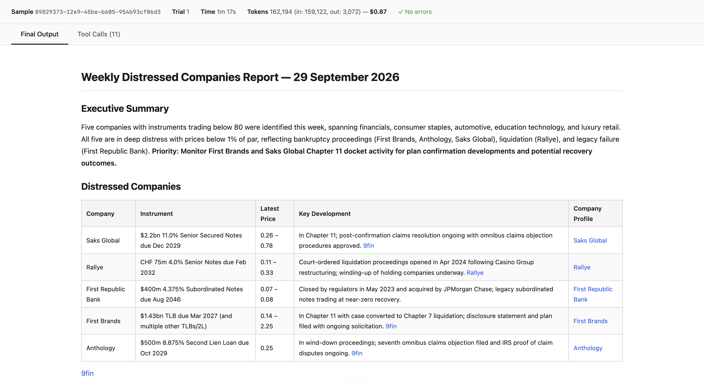
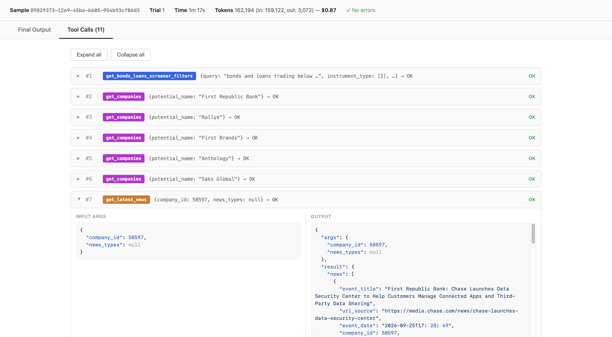

> [!WARNING]
> This is an entirely vibe-coded tool made for personal use.

# Eval Run Viewer

View eval run JSON output files as a readable report with rendered markdown and expandable tool calls.

## Usage

1. Edit `config.js` — set `evalOutputDir` to the absolute path of your local `.eval_runs/branch/raw_outputs/` directory
   ```js
   evalOutputDir: '/Users/uttam/Documents/Work/chat-retrieval/.eval_runs/branch/raw_outputs/'
   ```

2. Start the server. [Install uv](https://docs.astral.sh/uv/#installation) if you don't have it already.
   ```sh
   uv run server.py
   ```

3. Open http://localhost:8766/index.html

To view a different file, pass the filename as a query param:
```
http://localhost:8766/index.html?input=8fa4025a-3693-4f09-a798-8f4abeabac0c_trial_1.json
```

Ctrl+C to stop the server.

## Screenshots

Output


Tool calls (query and response)

